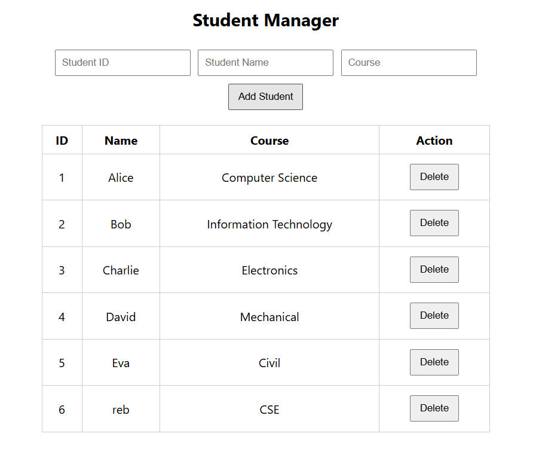
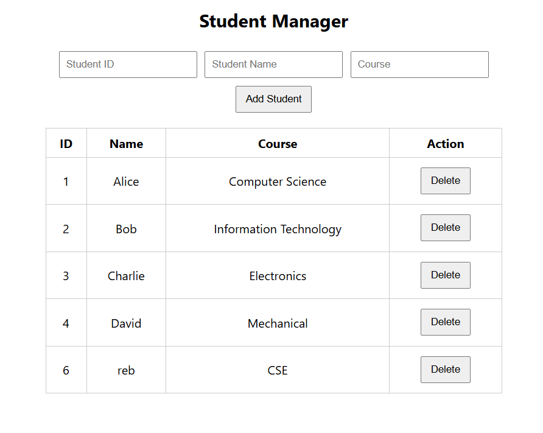
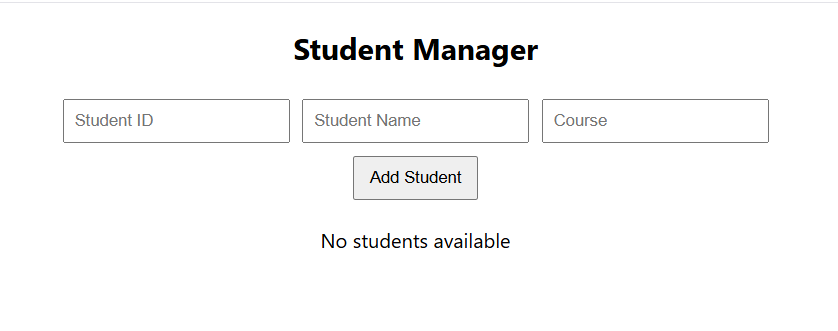

# Experiment 10 – React State Management using useState Object

## Name

Rebekah Meda

## Course

Full Stack Application Development (FSAD) Lab

---

## Objective

To implement a React component that manages a list of students using the **useState Hook**, allowing users to add new students, display them, and delete them dynamically without refreshing the page.

---

## Description

This experiment demonstrates state management in React using the **useState Hook**. A Student Manager application is created where the student list is stored as an array of objects in the component state. Users can add new students using input fields and remove students instantly. The UI updates automatically whenever the state changes.

---

## Technologies Used

* React.js
* JavaScript (ES6)
* HTML
* CSS
* Node.js
* VS Code

---

## Features Implemented

* Display initial list of students
* Add a new student using input fields
* Delete a student dynamically
* Automatic UI update using React state
* Display message when student list is empty
* Basic CSS styling for clean UI

---

## Student Object Structure

Each student object contains:

| Field  | Description    |
| ------ | -------------- |
| id     | Student ID     |
| name   | Student Name   |
| course | Student Course |

Example:

```
{
 id: 1,
 name: "Alice",
 course: "Computer Science"
}
```

---

## React Hook Used

### useState

The `useState` hook is used to manage:

* Student list (array of student objects)
* New student input values

Example:

```
const [students, setStudents] = useState(initialStudents);
```

---

## Application Interface

The interface contains:

* Input fields for **ID, Name, and Course**
* **Add Student** button
* Table displaying student list
* **Delete** button for each student

---

## Screenshots

### 1. Initial Student List


---

### 2. Adding a Student



---

### 3. Deleting a Student



---

### 4. Empty Student List Message



---

## Result

The Student Manager application successfully demonstrates **React state management using the useState Hook**. Students can be added and removed dynamically, and the interface updates instantly without reloading the page.

---

## Conclusion

This experiment shows how React Hooks simplify state management in functional components. The useState Hook enables efficient UI updates and dynamic interaction within the application.
