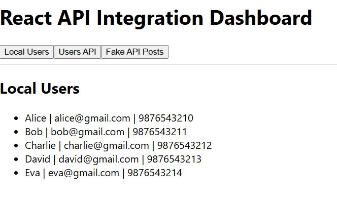
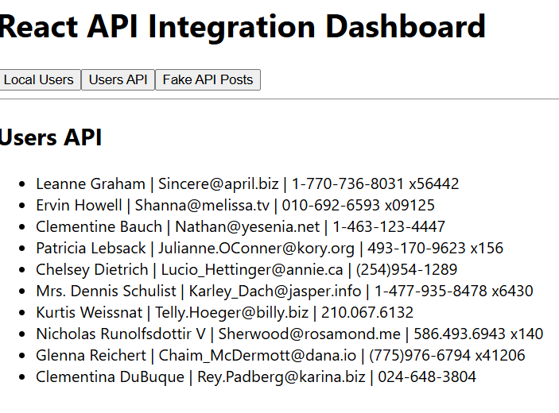
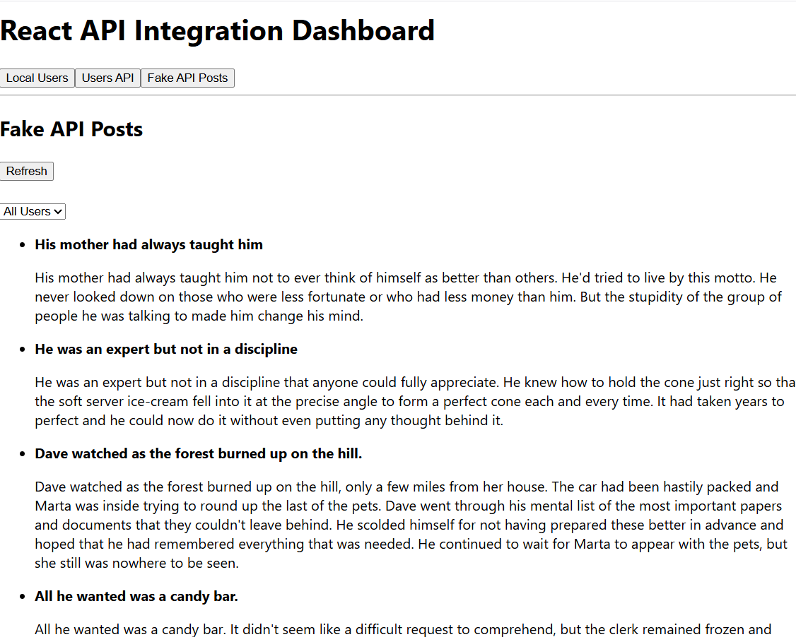
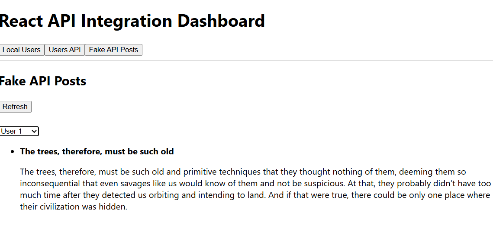
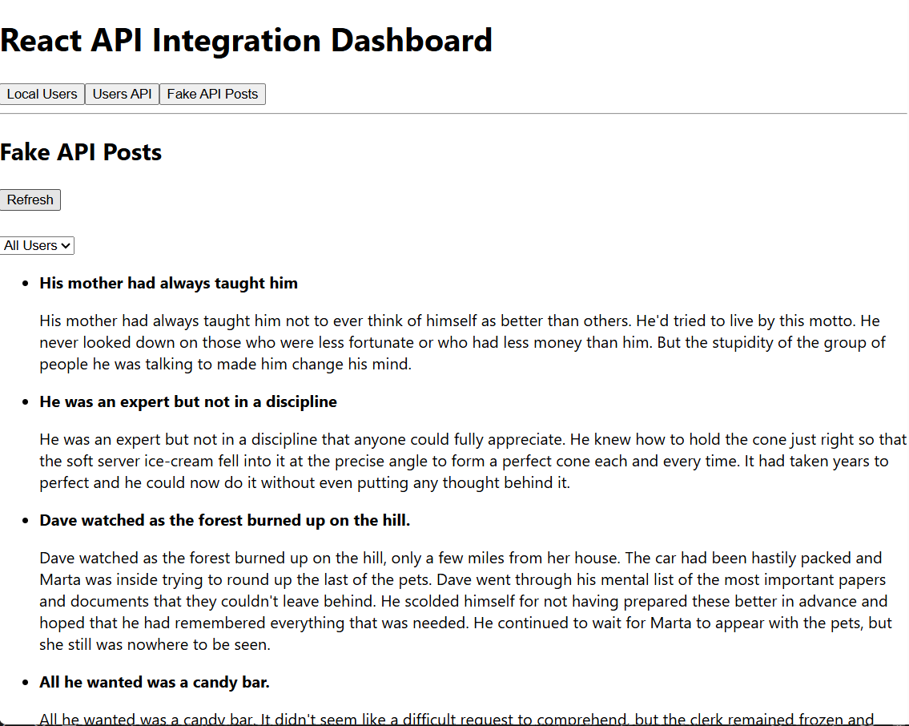

# Experiment 11 – React API Integration using Fetch API, Axios & Local JSON

## Course

Full Stack Application Development (FSAD) Lab

---

## Objective

To demonstrate how React applications fetch and display data dynamically using **local JSON files, public APIs, and fake APIs** with the help of **fetch(), axios, useState, and useEffect hooks**.

---

## Description

This experiment demonstrates API integration in React. A dashboard interface is created that allows users to navigate between different components which fetch data from multiple sources.

The application demonstrates:

* Fetching data from a **local JSON file**
* Fetching data from a **public API (JSONPlaceholder)**
* Fetching data from a **fake API using Axios**
* Filtering API results using dropdown selection
* Refreshing API data dynamically

---

## Technologies Used

* React.js
* JavaScript (ES6)
* Fetch API
* Axios
* HTML
* CSS
* Node.js
* VS Code

---

## Project Structure

```
react-api-integration
 ├── public
 │    └── users.json
 ├── src
 │    ├── components
 │    │     ├── Dashboard.js
 │    │     ├── LocalUserList.js
 │    │     ├── UserList.js
 │    │     └── FakePostList.js
 │    ├── App.js
 │    └── index.js
 ├── screenshots
 ├── package.json
 └── README.md
```

---

## Part A – Fetching from Local JSON

A **users.json** file is created inside the public folder.
The `LocalUserList` component fetches the data using **fetch()** and displays:

* Name
* Email
* Phone

It also handles **loading and error states**.

### Screenshot



---

## Part B – Fetching from JSONPlaceholder API

The `UserList` component fetches user data from the public API:

```
https://jsonplaceholder.typicode.com/users
```

The data is displayed with:

* Name
* Email
* Phone

### Screenshot



---

## Part C – Fetching from Fake API using Axios

The `FakePostList` component fetches posts using **Axios** from:

```
https://dummyjson.com/posts
```

Features implemented:

* Display post **title and body**
* **Refresh button** to reload API data
* **Dropdown filter** to filter posts by userId

### Screenshot



---

## Dropdown Filtering

A dropdown filter is implemented to filter posts based on **userId**.

### Screenshot



---

## Refresh Button

The refresh button triggers an event handler that:

1. Reloads posts from the API
2. Resets the dropdown filter
3. Displays all posts again

### Screenshot



---

## Dashboard Navigation

A `Dashboard` component is created to navigate between the three components using buttons:

* Local Users
* Users API
* Fake API Posts

### Screenshot


---

## Result

The React application successfully demonstrates API integration using **fetch() and axios**. Data is dynamically fetched and displayed from different sources, and the UI updates automatically based on user interaction.

---

## Conclusion

This experiment illustrates how modern frontend applications interact with APIs. Using React hooks such as **useState** and **useEffect**, developers can efficiently manage asynchronous API calls and dynamic UI updates.
