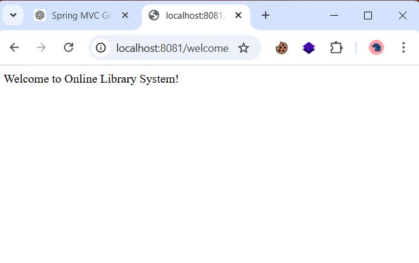

# Experiment 6 – Spring MVC Web Request Handling Demo

## Course

Full Stack Application Development (FSAD) Lab

---

## Objective

To understand how Spring MVC handles web requests and processes them using controller methods.

---

## Description

This experiment demonstrates a simple Spring MVC web application for an Online Library System. The application processes HTTP requests using controller classes and returns appropriate responses to the user. The controller maps URLs to methods using Spring MVC annotations and displays the welcome message on the browser.

---

## Technologies Used

* Java
* Spring MVC
* Maven
* Eclipse IDE
* Apache Tomcat

---

## Project Structure

```
src/main/java
   └── com.example.library
        └── controller
             └── LibraryController.java

src/main/resources
   └── application.properties

pom.xml
```

---

## Key Concepts Demonstrated

* Spring MVC Architecture
* Controller Layer
* Request Mapping
* Handling HTTP Requests
* Running a Spring Boot Web Application

---

## Application URL

```
http://localhost:8081/welcome
```

---

## Output Screenshot

The application successfully handled the web request and displayed the welcome message for the Online Library System.



---

## Result

The Spring MVC web application successfully handled HTTP requests and displayed the response through the controller method.

---

## Conclusion

This experiment demonstrates how Spring MVC maps web requests to controller methods and generates responses to the client, making web application development structured and efficient.
