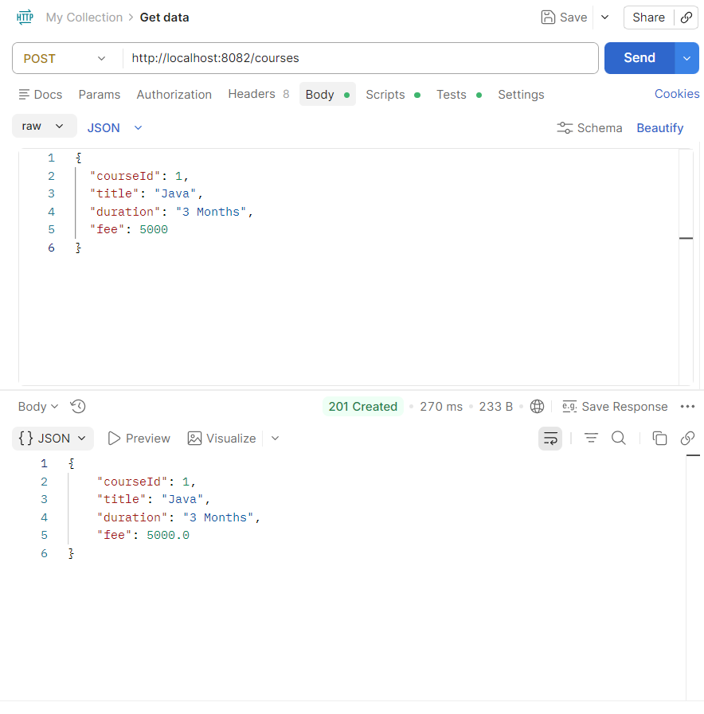
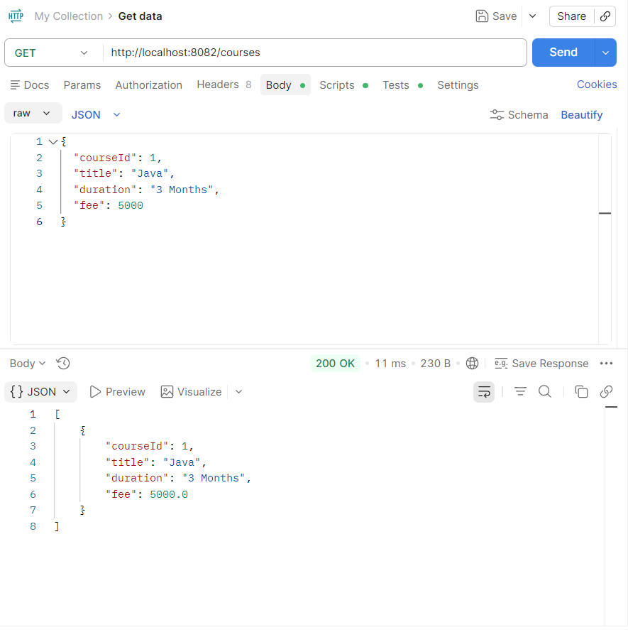
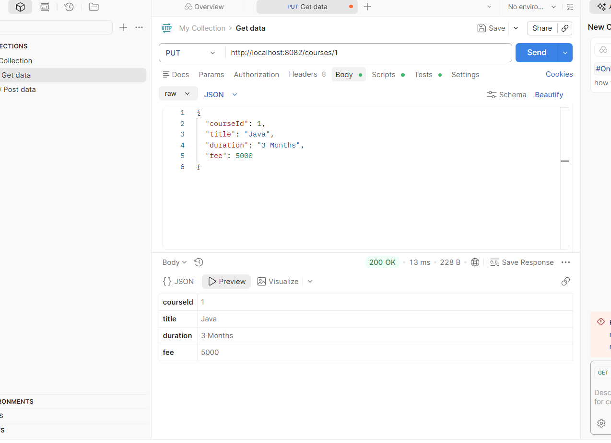
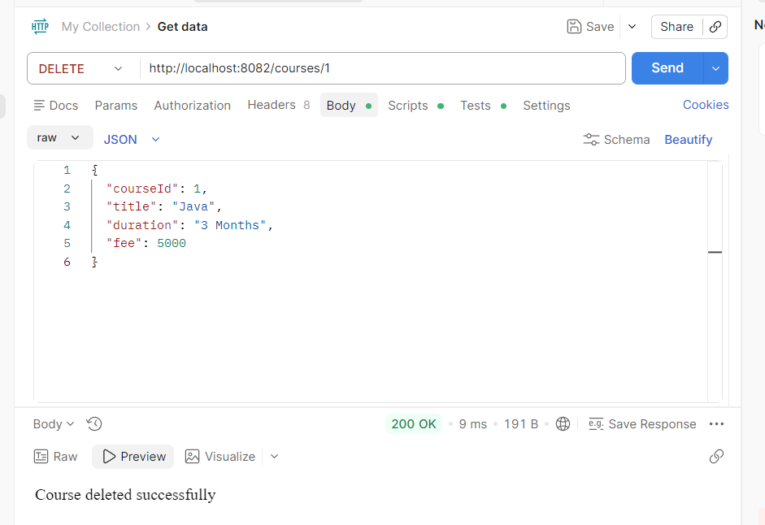

# Experiment 7 – REST API CRUD Operations using ResponseEntity

## Course

FSAD Lab – Spring Boot

## Objective

To implement a REST API using Spring Boot that performs CRUD operations on course data and returns proper HTTP responses using `ResponseEntity`.

---

## Description

In this experiment, a RESTful backend service is developed for managing university course details. The system allows administrators to add, update, delete, and retrieve course information. Each API endpoint returns appropriate HTTP status codes to ensure reliable communication between the client and server.

The application is tested using **Postman**.

---

## Technologies Used

* Java
* Spring Boot
* Maven
* REST API
* Postman
* Eclipse IDE

---

## Project Structure

```
courseapi
│
├── controller
│     └── CourseController.java
│
├── model
│     └── Course.java
│
├── service
│     └── CourseService.java
│
└── CourseapiApplication.java
```

---

## Course Entity

The Course object contains the following fields:

| Field    | Type   |
| -------- | ------ |
| courseId | int    |
| title    | String |
| duration | String |
| fee      | double |

---

## REST API Endpoints

### 1. Add Course

Method:

```
POST
```

URL:

```
/courses
```

Description: Adds a new course to the system.

Screenshot:





---

### 2. Get All Courses

Method:

```
GET
```

URL:

```
/courses
```

Description: Retrieves all courses available in the system.

Screenshot:





---

### 3. Update Course

Method:

```
PUT
```

URL:

```
/courses/{id}
```

Description: Updates an existing course using its ID.

Screenshot:



---

### 4. Delete Course

Method:

```
DELETE
```

URL:

```
/courses/{id}
```

Description: Deletes a course from the system.

Screenshot:



---

### 5. Search Course by Title

Method:

```
GET
```

URL:

```
/courses/search/{title}
```

Description: Searches for courses based on their title.

Screenshot:


---

## HTTP Status Codes Used

| Status Code     | Meaning                       |
| --------------- | ----------------------------- |
| 200 OK          | Request successful            |
| 201 CREATED     | Resource created successfully |
| 404 NOT FOUND   | Resource not found            |
| 400 BAD REQUEST | Invalid request               |

---

## Result

The REST API was successfully implemented using Spring Boot. All CRUD operations were tested using Postman, and the server returned appropriate HTTP responses using `ResponseEntity`.

---

## Conclusion

This experiment demonstrates how Spring Boot can be used to build RESTful APIs with proper response handling. Using `ResponseEntity` helps in returning structured responses and HTTP status codes, improving communication between the client and server.
