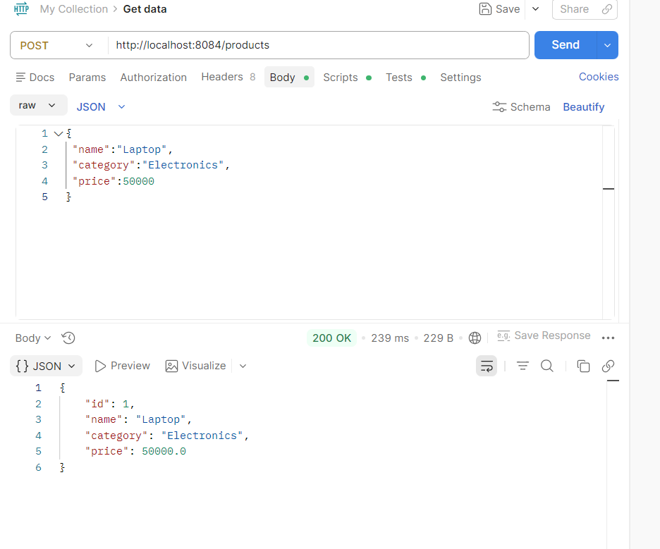
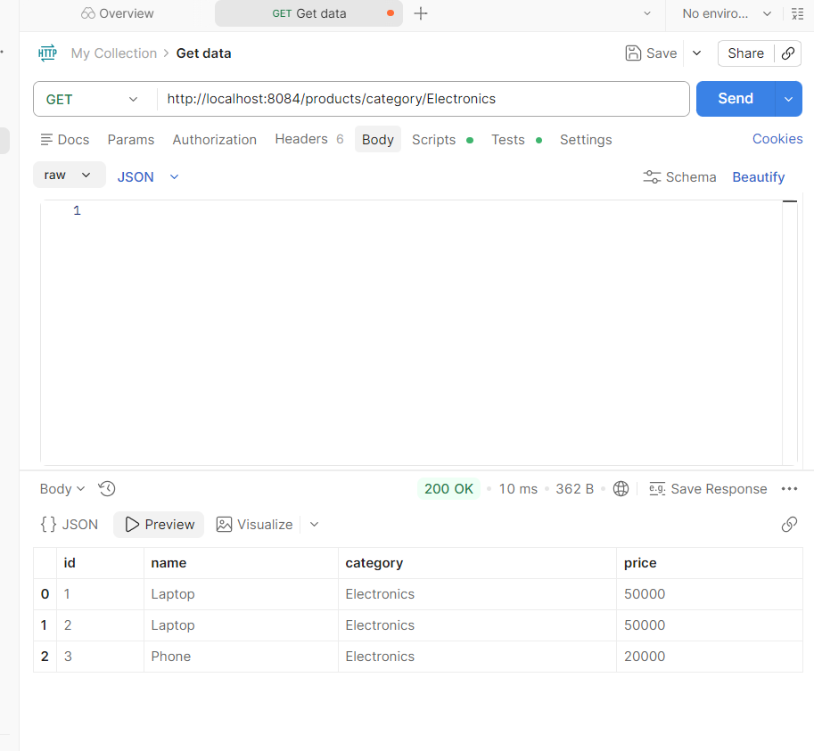
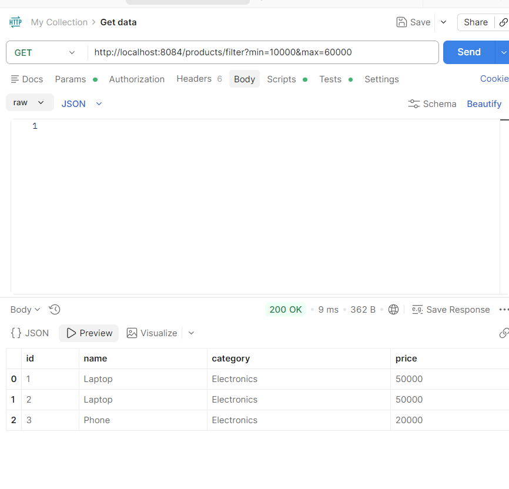
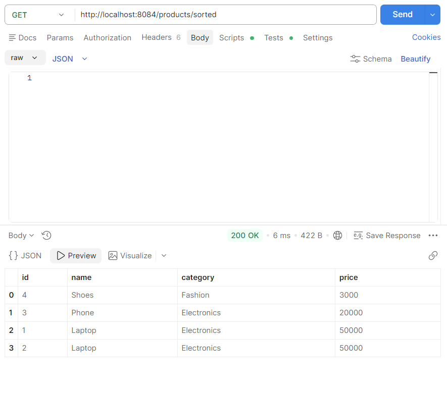
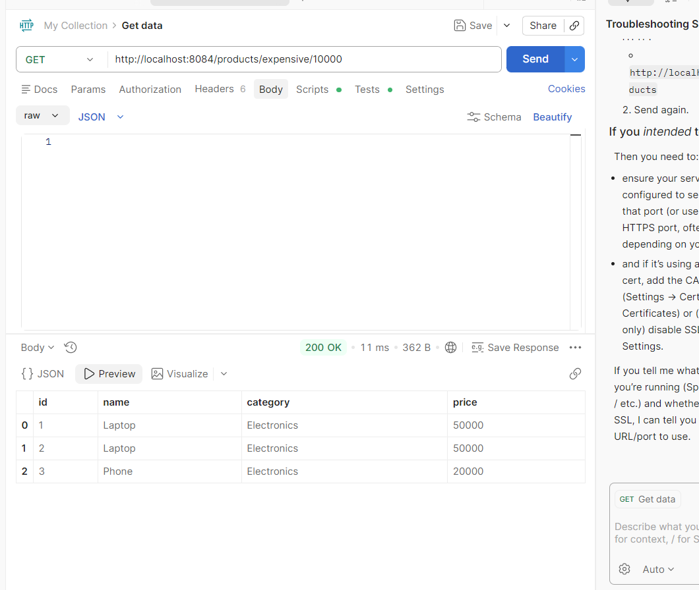

# Experiment 8 – Spring Boot JPQL & Query Methods

## Name

Rebekah Meda

## Course

Full Stack Application Development (FSAD) Lab

---

## Objective

To implement a product search module using Spring Boot and Spring Data JPA that supports category-based search, price filtering, sorting, and custom JPQL queries.

---

## Description

This experiment demonstrates how to use Spring Data JPA derived query methods and JPQL queries in a Spring Boot application. The application allows users to search products by category, filter products within a price range, sort products by price, and retrieve expensive products based on price criteria.

The APIs are tested using **Postman**.

---

## Technologies Used

* Java
* Spring Boot
* Spring Data JPA
* H2 Database
* Maven
* Eclipse IDE
* Postman

---

## Product Entity

The Product entity contains the following fields:

| Field    | Type   |
| -------- | ------ |
| id       | Long   |
| name     | String |
| category | String |
| price    | double |

---

## REST API Endpoints

### 1. Add Product

POST `/products`



---

### 2. Search Products by Category

GET `/products/category/{category}`

Example:

```
/products/category/Electronics
```



---

### 3. Filter Products by Price Range

GET `/products/filter?min=&max=`

Example:

```
/products/filter?min=10000&max=60000
```



---

### 4. Sort Products by Price

GET `/products/sorted`



---

### 5. Fetch Expensive Products

GET `/products/expensive/{price}`

Example:

```
/products/expensive/10000
```



---

## Result

The product search module was successfully implemented using Spring Boot and Spring Data JPA. The application supports category-based search, price filtering, sorting, and JPQL-based queries, and the results were verified using Postman.

---

## Conclusion

This experiment demonstrates how Spring Data JPA simplifies database queries using derived methods and JPQL queries, enabling efficient data retrieval in Spring Boot applications.
